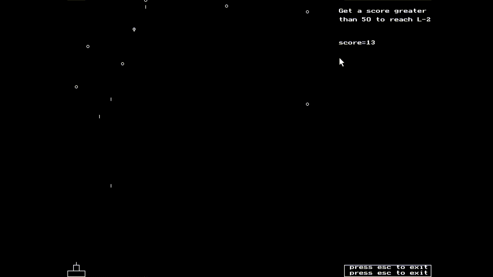

# Asteroids
This repo contains code for playing the asteroid game. It can only be run on Turbo C++. The keyboard is used to move the spaceship around. The position of the asteroids coming down is generated using a random generator, but as the code is rerun systematically, a pattern arises in the location of the asteroids.

## Game preview

Controls are: 
a - move left 
d - move right 
space - shot 

The score and some instructions can be seen on the right side of the screen. The mouse can only move around in the right section. There are two ways to exit the program: you can move your cursor to the bottom box and click or press ESC directly. The game has two levels currently. In the second level, the asteroids come down faster.